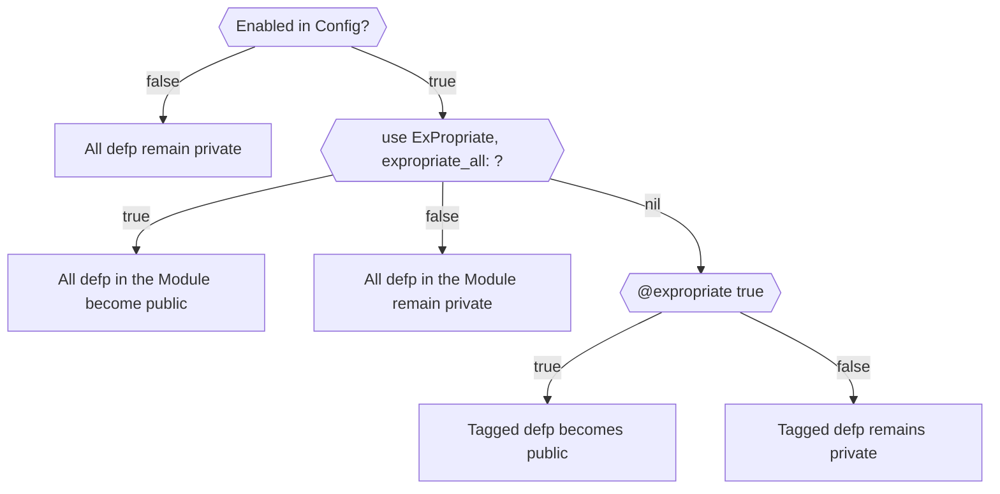

# ExPropriate

ExPropriate is an Elixir library that allows you to decide whether or not a function is public at
compile time.

When would you want to do this?

Testing.

There's an argument to be had that you should be testing your private functions through your public
interfaces, and I agree! But it's also true that often times projects grow more complicated than
you'd wish.

The aim is to provide a way to be able to test your overly complicated private functions without
compromising the design. So that you may eventually refactor as necesary.

When push comes to shove, a questionably designed, but well tested function is better than a
questionably designed and vaguely tested one.

## Installation

| | |
|----|----|
| :warning: **WIP** |  At this time the library is in a proof of concept state. More tests and documentation need to be added before I consider it in a publishable state, but feel free to pull from github and open issues if you find any. |

In `mix.exs`, add the ExPropriate dependency:

```elixir
def deps do
  [
    {:ex_propriate, git: "https://github.com/pyzlnar/ex_propriate"}
  ]
end
```

Then run `mix deps.get` to install it.

```bash
$ mix deps.get
```

Now add this configuration in your test config, or any other env you wish your functions to be
expropriated.

```elixir
# config/test.exs
config ExPropriate,
  enable: true
```

It may also be useful to configure your dev environment like this, so you can test expropriated
functions in console.

```elixir
# config/dev.exs
config ExPropriate,
  enable: System.get_env("EXPROPRIATE_ENABLED") == "true"
```

```bash
EXPROPRIATE_ENABLED=true iex -S mix
iex>
```

## Usage

There are two ways in which you can use ExPropriate in a module:

- Module level granularity
- Function level granularity

**Module Level Granularity**:

This level will expropriate _all_ private functions in the module, giving them public access.

```elixir
defmodule MyModule do
  use ExPropriate,
    expropriate_all: true

  defp my_private_function,
    do: :has_been_expropriated
end

MyModule.my_private_function
# :has_been_expropriated
```

It's also worth mentioning that this granularity level is by design less "_intrusive_" than the
function one, so if you're having issues with the later, you can try using this one as a fallback.

**Function Level Granularity**:

```elixir
defmodule MyModule do
  use ExPropriate

  # Function becomes public
  @expropriate true
  defp expropriated_function,
    do: :am_expropriated

  # Funcitions with multiple bodies only need to be tagged on the first body
  @expropriate true
  defp divide_by(number) when is_integer(number) and number > 0,
    do: {:ok, div(100, number)}

  defp divide_by(_other),
    do: :error

  # Untagged functions remain private
  @expropriate false
  defp remains_private,
    do: :am_private
end

MyModule.expropriated_function
# :am_expropriated

MyModule.divide_by(2)
# {:ok, 50}
MyModule.divide_by(0)
# :error

MyModule.remains_private
# (UndefinedFunctionError) function MyModule.remains_private/0 is undefined or private.
```

This graph may also help you visualize how ExPropriate decides when and which private functions to
expropriate.



### Limitations

Some libraries may define their own versions of `def` and `defp`.

It's advised **against** using ExPropriate in modules that implement such libraries, but if you do
be wary about:

- Any side-effect your library may have by making a function public
- You're responsible for excluding the `[defp: 1, defp: 2]` functions from being imported from the
  library. (Otherwise you'll get compilation errors due ambiguity)
- Only **Module Granularity** (`expropariate_all`) is (_loosely_) supported.

Here's an example of how you may set it up:

```elixir
use OtherLibrary
use ExPropriate, expropriate_all: true do
  # The do block is only used if :expropriate_all is true
  import OtherLibrary.Macros, except: [defp: 1, defp: 2]
end
```

## Docs

Documentation can be generated with [ExDoc](https://github.com/elixir-lang/ex_doc)
and published on [HexDocs](https://hexdocs.pm). Once published, the docs can
be found at <https://hexdocs.pm/ex_propriate>.
