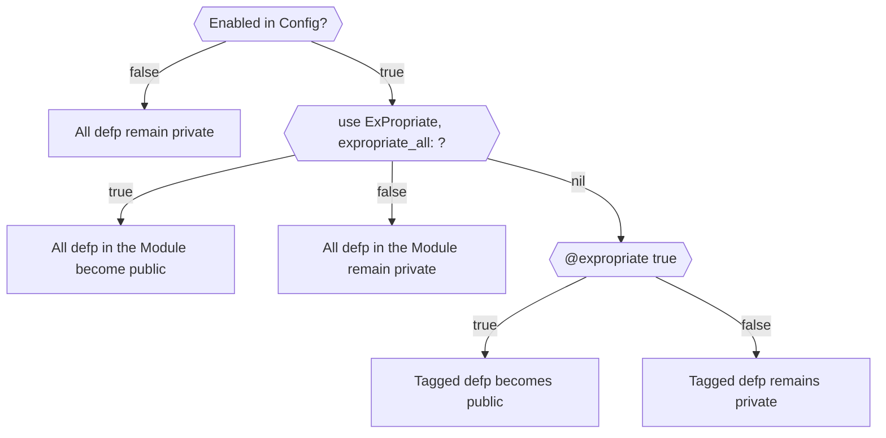

# ExPropriate

[](https://hex.pm/packages/ex_propriate)
[](https://github.com/pyzlnar/ex_propriate/actions/workflows/elixir.yml?query=branch%3Amaster)
[](https://opensource.org/licenses/MIT)

ExPropriate is an Elixir library that allows you to decide whether or not a function is public at
compile time.

When would you want to do this?

Testing.

There's an argument to be had that you should be testing your private functions through your public
interfaces, and I agree! But it's also true that often times projects grow more complicated than
you'd wish.

The aim of this library is to provide a way to be able to test your overly complicated private
functions without making changes in the design.

When push comes to shove, a questionably designed but well tested function is better than a
questionably designed and vaguely tested one.


## Installation

In `mix.exs`, add the ExPropriate dependency:

```elixir
def deps do
  [
    {:ex_propriate, "~> 0.1"}
  ]
end
```

Then run `mix deps.get` to install it.

```bash
$ mix deps.get
```

Now add this configuration in your test config, or any other env you wish your functions to be
expropriated.

```elixir
# config/test.exs
config ExPropriate,
  enable: true
```

It may also be useful to configure your dev environment like this, so you can test expropriated
functions in console.

```elixir
# config/dev.exs
config ExPropriate,
  enable: System.get_env("EXPROPRIATE_ENABLED") == "true"
```

```bash
EXPROPRIATE_ENABLED=true iex -S mix
iex>
```

## Usage

There are two ways in which you can use ExPropriate in a module:

- Module level granularity
- Function level granularity

**Module Level Granularity**:

This level will expropriate _all_ private functions in the module, giving them public access.

```elixir
defmodule MyModule do
  use ExPropriate,
    expropriate_all: true

  defp my_private_function,
    do: :has_been_expropriated
end

MyModule.my_private_function
# :has_been_expropriated
```

It's also worth mentioning that this granularity level is by design less "_intrusive_" than the
function one, so if you're having issues with the later, you can try using this one as a fallback.

**Function Level Granularity**:

This level will only expropriate functions that are tagged with the `@expropriate` attribute set
to `true`.

```elixir
defmodule MyModule do
  use ExPropriate

  # Function becomes public
  @expropriate true
  defp expropriated_function,
    do: :am_expropriated

  # Functions with multiple bodies only need to be tagged on the first body
  @expropriate true
  defp divide_by(number) when is_integer(number) and number > 0,
    do: {:ok, div(100, number)}

  defp divide_by(_other),
    do: :error

  # Untagged functions remain private
  @expropriate false
  defp remains_private,
    do: :am_private
end

MyModule.expropriated_function
# :am_expropriated

MyModule.divide_by(2)
# { :ok, 50 }
MyModule.divide_by(0)
# :error

MyModule.remains_private
# (UndefinedFunctionError) function MyModule.remains_private/0 is undefined or private.
```

This graph may also help you visualize how ExPropriate decides when and which private functions to
expropriate.



## Limitations

Some libraries define their own versions of `def` and `defp`.

It's advised **against** using ExPropriate in modules that implement such libraries. If you want to
try regardless, please be aware that:

#### Only **Module Granularity** (`expropriate_all`) is (_loosely_) supported.

Function-level granularity explicitly defines functions with `Kernel.def/2` and `Kernel.defp/2`, so
even if things seem to work at first, you are probably loosing the functionality that you're seeking
from the other library.

#### If the library only overrides `def/2`

Libraries that override `Kernel.def/2` typically do so to enhance functionality. Since expropriating
a function basically makes it public, be wary of any unwanted side-effect that may occur.

Other than that, the setup should look something like this:

```elixir
defmodule MyModule do
  use OtherLibrary

  use ExPropriate,
    expropriate_all: true
end
```

#### If the library also overrides `defp/2`

Welp.

You really shouldn't use `ExPropriate` in that module, but if you absolutely must... \
You'll be trading off the functionality of that library's `defp/2` whenever you expropriate the
functions. You'll also be responsible of preventing the import of said library's `defp/2`, otherwise
you'll get compilation errors.

The setup would look something like this:

```elixir
demfodule MyModule do
  use OtherLibrary

  if Application.compile_env(:ex_propriate, :enable) do
    import OtherLibrary.Macros, except: [defp: 1, defp: 2]

    use ExPropriate,
      expropriate_all: true do
  end
end
```

## License

ExPropriate is released under the [MIT License](https://opensource.org/licenses/MIT).
