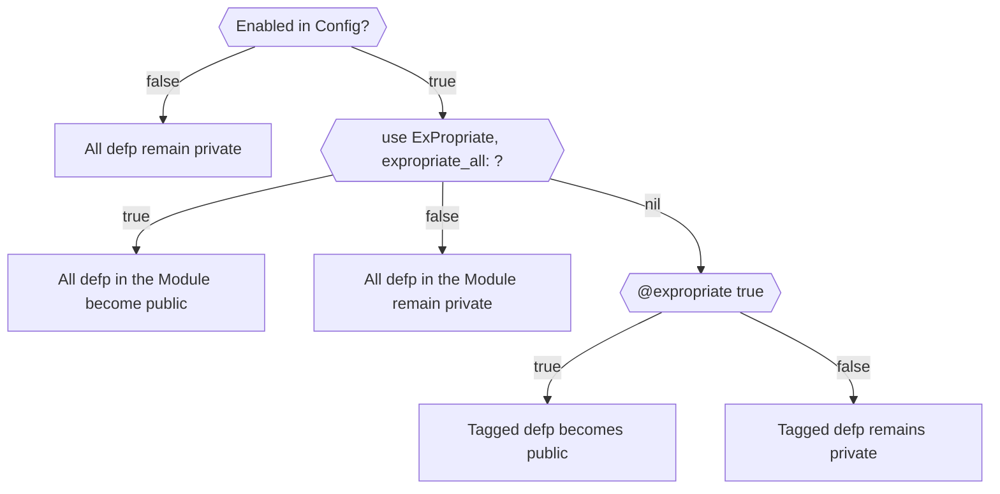

# ExPropriate

ExPropriate is an Elixir library that allows you to decide whether or not a function is public at
compile time.

When would you want to do this?

Testing.

There's an argument to be had that you should be testing your private functions through your public
interfaces, and I agree! But it's also true that often times projects grow more complicated than
you'd wish.

The aim is to provide a way to be able to test your overly complicated private functions without
compromising the design. So that you may eventually refactor as necesary.

When push comes to shove, a questionably designed, but well tested function is better than a
questionably designed and vaguely tested one.

## WIP

At this time the library is in a proof of concept state, but I want to add more granularity on
config level and function level.

### Granularity

How I would like syntax-wise to work.

Full disclaimer tho, I'm unsure if I can make the function_level tagging work, but you can be sure
I will try.



```elixir
# config/dev.exs

# This is the default setting
config ExPropriate,
  expropriate: false

# config/test.exs

# Enable in required environments
config ExPropriate,
  expropriate: true
```

```elixir
# Module wide granularity

# All defps in the module become public
defmodule MyModule do
  use ExPropriate, expropriate_all: true
end

# All defps in the module remain private
def module MyModule do
  use ExPropriate, expropriate_all: false
end
```

```elixir
# Function level granularity
defmodule MyModule do
  use ExPropriate

  # Function becomes public
  @expropriate true
  defp my_expropriated_function(), do: :ok

  # Function remain private
  @expropriate false
  defp my_private_function(), do: :ok

  # Untagged remains private
  defp my_other_private_function(), do: :ok
end
```

### Limitations

Some libraries may define their own versions of `def` and `defp`.

It's advised against using ExPropriate with such libraries, but if you do be wary about:

- Any side-effect your library may have by making a function public
- You're responsible for excluding the `[defp: 1, defp: 2]` functions from being imported from the
  library. (Otherwise you'll get compilation errors due ambiguity)
- It's preferred you use module-level granularity over function-level, as the later uses explicit
  callers.

Here's an example of how you may set it up:

```elixir
# With module level granularity
use OtherLibrary
use ExPropriate, expropriate_all: true do
  # The do block is only used if :expropriate_all is true
  import OtherLibrary.Macros, except: [defp: 1, defp: 2]
end

# ----

# With function level granularity
use OtherLibrary
import OtherLibrary.Macros, except: [defp: 1, defp: 2]
use ExPropriate, with: OtherLibrary

# This is roughly how the macro will be expanded
# :with defaults to Kernel
if should_expropriate? do
  def unquote(function_head), do: unquote(function_body)
else
  with.defp unquote(function_head), do: unquote(function_body)
end
```

### Configuration

## Installation

If [available in Hex](https://hex.pm/docs/publish), the package can be installed
by adding `ex_propriate` to your list of dependencies in `mix.exs`:

```elixir
def deps do
  [
    {:ex_propriate, "~> 0.1.0"}
  ]
end
```

Documentation can be generated with [ExDoc](https://github.com/elixir-lang/ex_doc)
and published on [HexDocs](https://hexdocs.pm). Once published, the docs can
be found at <https://hexdocs.pm/ex_propriate>.

